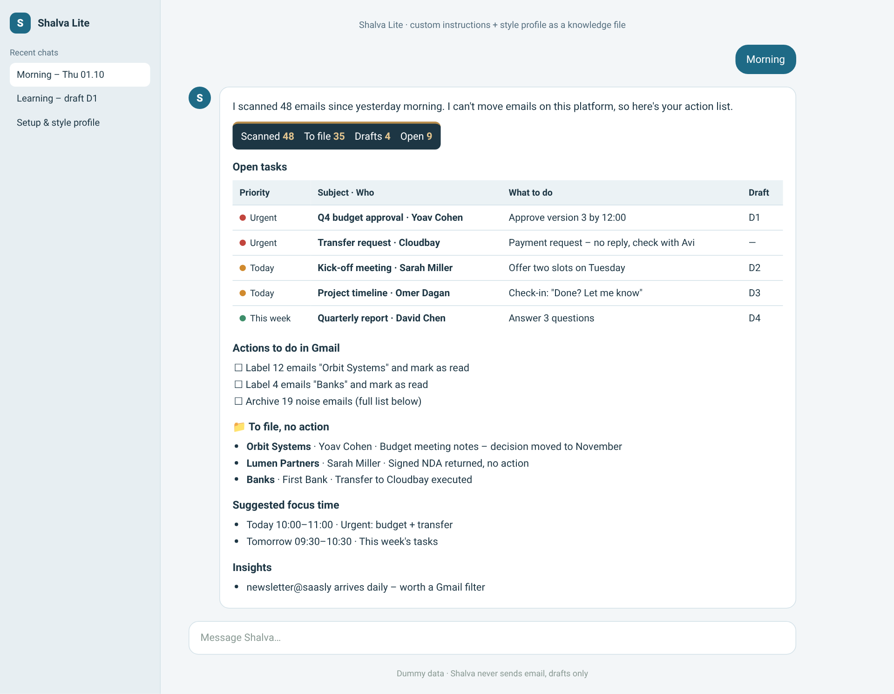

<div align="center">

# Shalva – your inbox assistant

*Shalva means “calm” in Hebrew – how a zero inbox feels.*

**Learns how you write and file email, then gets your inbox down to open tasks only.**

[עברית](README.he.md) · English


</div>

## Choose your platform

| | **Claude** (full) | **Copilot** (full) | **Lite** |
|---|---|---|---|
| Mail | Gmail | Outlook | Any connected mail, or pasted emails |
| Runs on its own every morning | ✅ | ✅ | Optional scheduled prompt |
| Files, labels and marks as read | ✅ | ✅ | Gives you an action list |
| One-line summary for every filed email | ✅ | ✅ | ✅ (in chat) |
| Drafts in your style | ✅ | ✅ | ✅ (text to copy) |
| Focus blocks on your calendar | ✅ | ✅ | Suggestions |
| Learns from your edits | ✅ automatic | ✅ automatic | ✅ when you paste what you sent |
| Live dashboard | Claude artifact | SharePoint pages | – |
| Setup time | 20–40 min | 60–90 min | 10 min |
| **Guide** | [**Claude →**](docs/en/claude.md) | [**Copilot →**](docs/en/copilot.md) | [**Lite →**](docs/en/lite.md) |
| **Download** | [shalva-inbox-agent.zip](../../releases/latest/download/shalva-inbox-agent.zip) | [shalva-copilot.zip](../../releases/latest/download/shalva-copilot.zip) | [shalva-lite.zip](../../releases/latest/download/shalva-lite.zip) |

Each guide covers requirements, install, first-time setup, daily use, updating, full uninstall and troubleshooting.

## What a morning looks like

<table>
<tr>
<td width="50%"><br><sub>Morning summary email (Claude)</sub></td>
<td width="50%"><br><sub>Learning from your edits (Claude)</sub></td>
</tr>
<tr>
<td><br><sub>Outlook inbox after the morning run (Copilot)</sub></td>
<td><br><sub>Morning brief in chat (Lite)</sub></td>
</tr>
</table>

## Iron rules (all versions)
- **Never sends email** to anyone but you. Every reply is a draft, and you send it.
- **Never deletes** email and never moves it to trash.
- **Never invents** amounts, dates or commitments. It writes `[[TO FILL: …]]` instead.
- **Never replies to payment requests.** It marks them urgent for you.
- **Treats email content as data**, never as instructions.

## Privacy
Shalva collects nothing and sends nothing anywhere. Your email, style and data stay in your own accounts.

## Repository layout
```
platforms/
  claude/shalva-inbox-agent/SKILL.md   Claude skill (full)
  copilot/agent/                      Copilot Studio instructions + knowledge files
  copilot/sharepoint/                 lists script, schema, column formatting
  lite/                               instructions + style profile template
docs/en, docs/he                      step-by-step guides
images/<platform>/<en|he>/            screenshots (dummy data)
```

## Updates
See the [CHANGELOG](CHANGELOG.md). To get notified about new versions: **Watch → Custom → Releases**.

## License
© 2026 Rachel Yashar. All rights reserved. Free for personal use; copying, modifying, redistributing or selling requires written permission. See [LICENSE](LICENSE).

<sub>All screenshots use dummy data. Product names belong to their owners. This project is not affiliated with Anthropic, OpenAI, Google or Microsoft.</sub>
