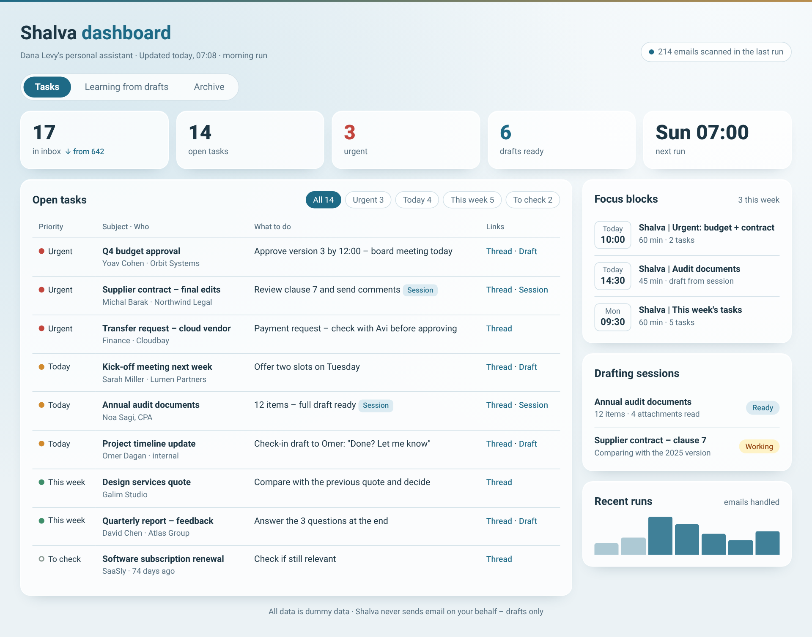
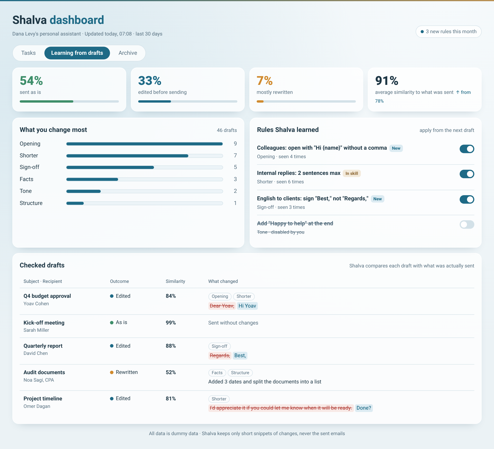
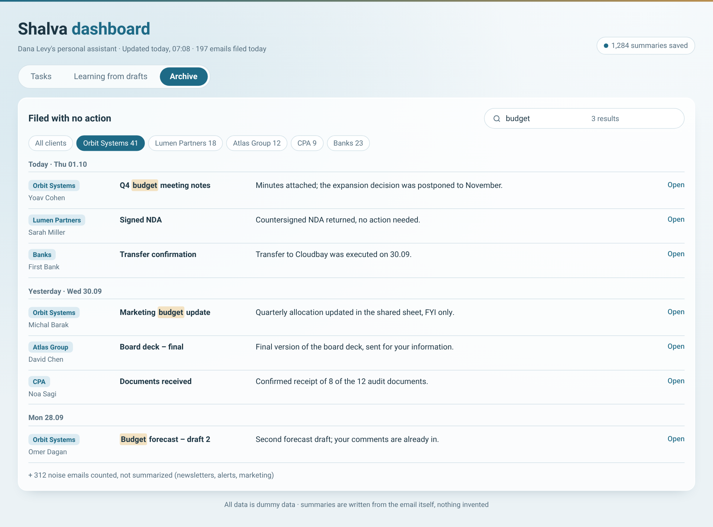
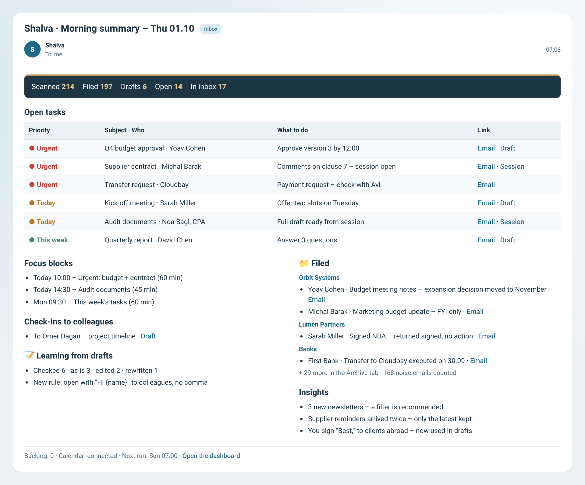

# Shalva for Claude – the full version

[עברית](../he/claude.md) · [Back to main page](../../README.md)

This is the full version of Shalva, for Gmail and Google Calendar. It runs on its own every morning.

## What you get

| Dashboard – tasks | Learning from drafts |
|---|---|
|  |  |
| **Searchable archive** | **Morning summary email** |
|  |  |

- **Daily triage:**
  - No-action email gets a client label, is archived and marked as read, with a one-line summary.
  - Email that needs you stays in the inbox, unread, with a priority label.
- **Drafts in your style:** in the language of the incoming email, including check-ins to colleagues ("Done? Let me know").
- **Focus blocks:** up to 3 a day on your calendar, with no attendees and no invitations.
- **Drafting sessions for complex emails:** a separate session reads the full thread and its attachments and writes a complete draft.
- **Learning from drafts:** every draft is compared with what you actually sent, and repeated changes become rules.
- **Live dashboard:** three tabs – tasks, learning from drafts and archive.
- **Summary email** at the end of every run.

## Requirements
- **Claude plan:** Pro, Max, Team or Enterprise.
- **Code execution and file creation:** turned on. Skills need them.
- **Scheduled tasks:** available on your account.
- **Connectors:** Gmail (required) and Google Calendar (recommended).

## Install
1. **Download** `shalva-inbox-agent.zip` from [Releases](../../../../releases/latest). Don't unzip it.
2. **Upload it to Claude:** go to **Settings → Capabilities → Skills**, click **Upload skill** and choose the file. In some versions this is under **Customize → Skills**.
3. **Connect Gmail and Google Calendar** in **Settings → Connectors**.
4. **Start setup:** open a new chat and type **"Set up Shalva"**.

## Setup (once, 20–40 minutes)
Shalva guides you through it:
1. **Language:** asks which language to use with you.
2. **A few questions:** autonomy, work hours, per-run budget and calendar.
3. **Overview:** counts your labels and what's in your inbox.
4. **Style:** learns your writing style from 150–300 emails you sent.
5. **Labeling map:** maps each domain to a label. For shared senders such as banks or your accountant, it asks you first.
6. **Old drafts:** recommends which to delete, and deletes only after you approve.
7. **Builds everything:**
   - `00 Shalva/…` labels.
   - A personal skill `shalva-<name>`. **Click Save on the card that appears.**
   - A morning scheduled task.
   - The dashboard.

## Daily use
- **Every morning** you get "Shalva · Morning summary" with open tasks, links and drafts.
- **What stays in the inbox** is unread and needs you.
- **Drafts** are in your Gmail Drafts folder. You edit and send them yourself. Shalva never sends.
- **Dashboard:**
  - **Archive** tab: search by client, sender, subject or summary.
  - **Learning** tab: turn rules on or off.
- **New rules:** when Shalva learns rules, the summary email says how many are waiting. In your next chat, type "update my skill with the new rules" and save the card.

## Update to a new version
1. Download the new zip from Releases.
2. In **Settings → Capabilities → Skills**, delete the old `shalva-inbox-agent` and upload the new one.
3. Tell Claude: **"Update my Shalva to the new version"**. It merges the changes into your personal skill and shows a card to save.

Your personal skill, dashboard and scheduled task keep working throughout. See the [CHANGELOG](../../CHANGELOG.md) for what changed.

## Uninstall completely
Shalva never deleted an email, and uninstalling doesn't touch your email either. Remove things in this order:
1. **Stop the runs.** Tell Claude "Delete Shalva's scheduled task", or delete it from your scheduled tasks list.
2. **Delete the skills.** In **Settings → Capabilities → Skills**, delete `shalva-<name>` and `shalva-inbox-agent`.
3. **Delete the dashboard** from your Artifacts gallery.
4. **Gmail (optional):**
   - Delete the `00 Shalva/…` labels. Deleting a label does not delete its emails.
   - Client labels Shalva added stay; it's fine to keep them.
   - Drafts Shalva created stay in Drafts until you delete them.
5. **Calendar (optional):** delete future events whose title starts with "Shalva |".
6. **Connectors (optional):** disconnect Gmail and Calendar in **Settings → Connectors**.

## Troubleshooting
| What happens | What to do |
|---|---|
| No email in the morning | Check that the scheduled task is enabled. A task set to ask for approval stops when no one approves. If your organization allows it, turn on automatic approval in the task's settings |
| "No calendar access" | Reconnect Google Calendar in Connectors |
| Dashboard not updating | Ask Claude: "check that Shalva writes to the dashboard". The dashboard URL must be in your personal skill |
| Drafts in the wrong tone | Edit and send as usual; after two times Shalva learns a rule. You can also tell it directly in chat |
| An email got the wrong label | Tell Shalva in chat, e.g. "emails from X belong to client Y". The rule goes into your personal skill |

## Privacy and safety
- **Sending:** Shalva sends email only to you.
- **Deleting:** Shalva never deletes email or moves it to trash.
- **Payment requests:** Shalva never replies to them.
- **Your data:** stays in your Claude and Gmail accounts.
- **Usage reporting:** none. Shalva reports nothing anywhere.
