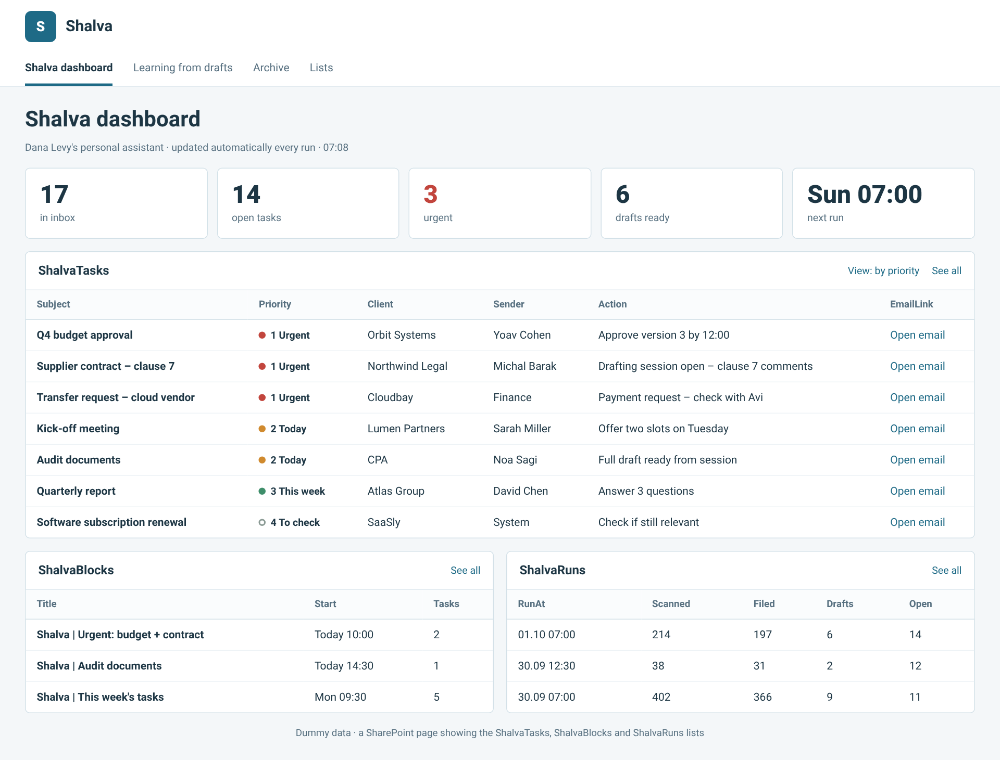
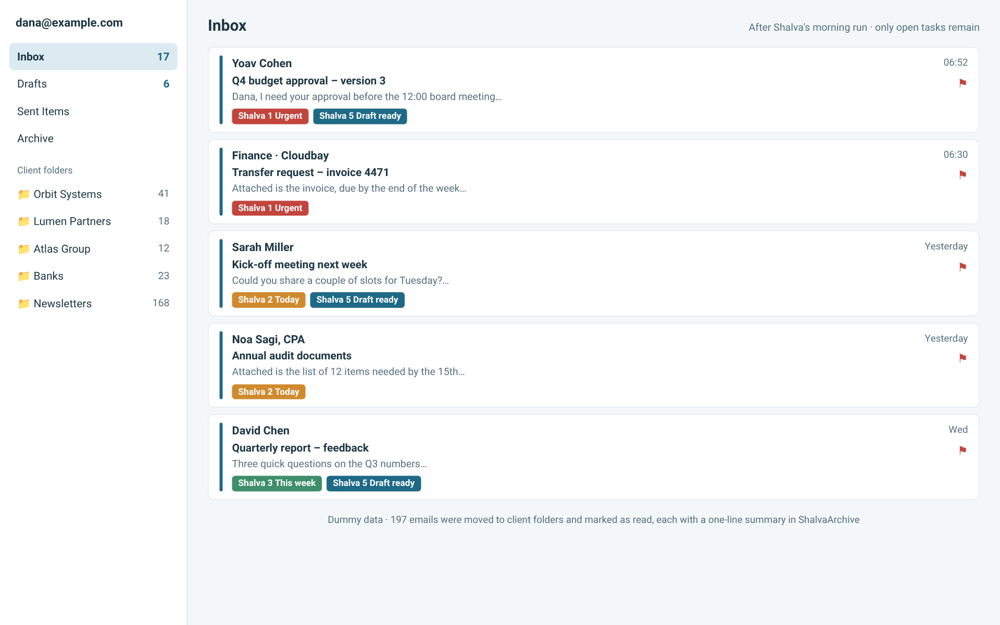
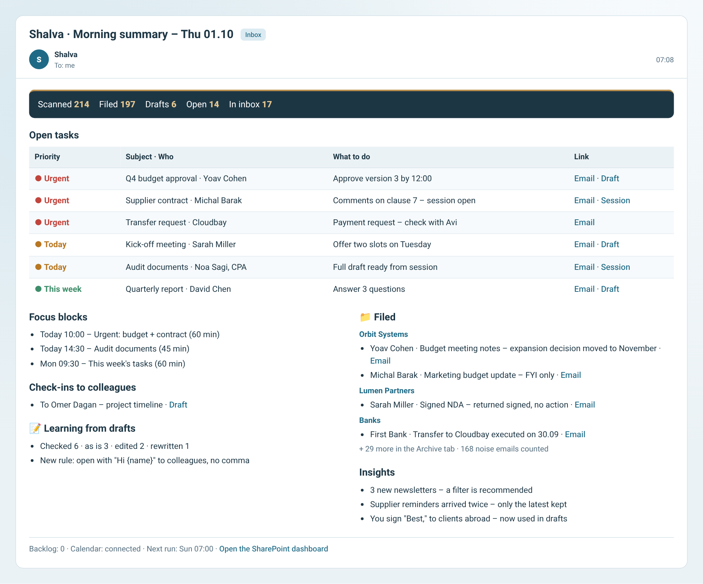

# Shalva for Copilot – Outlook and Microsoft 365

[עברית](../he/copilot.md) · [Back to main page](../../README.md)

Shalva for Copilot is the full version of Shalva for Outlook. It's an autonomous Copilot Studio agent that runs every morning and does what the Claude version does:

- Files each no-action email to its client folder, marks it as read and saves a one-line summary.
- Prioritizes the rest with categories and flags.
- Drafts replies in your style.
- Blocks focus time on your calendar.
- Learns from how you edit its drafts.
- Updates a SharePoint dashboard and emails you a summary.

| SharePoint dashboard | Inbox after the morning run | Summary email |
|---|---|---|
|  |  |  |

Estimated build time: 60–90 minutes, once.

## Files
| File | Purpose |
|---|---|
| [`agent/INSTRUCTIONS.md`](../../platforms/copilot/agent/INSTRUCTIONS.md) | Agent instructions (~5,000 characters) |
| [`agent/SHALVA-PLAYBOOK.md`](../../platforms/copilot/agent/SHALVA-PLAYBOOK.md) | Knowledge: all procedures in detail |
| [`agent/STYLE-PROFILE.md`](../../platforms/copilot/agent/STYLE-PROFILE.md) | Knowledge: style profile template, which Shalva fills in |
| [`agent/SUMMARY-EMAIL.html`](../../platforms/copilot/agent/SUMMARY-EMAIL.html) | Knowledge: summary email template |
| [`sharepoint/create-lists.ps1`](../../platforms/copilot/sharepoint/create-lists.ps1) | Script that creates the 7 lists |
| [`sharepoint/lists-schema.md`](../../platforms/copilot/sharepoint/lists-schema.md) | List structure, if you build the lists by hand |
| [`sharepoint/formatting/*.json`](../../platforms/copilot/sharepoint/formatting) | Column formatting: priority dots, draft outcome, rule on/off button |

## Requirements
- **Microsoft 365** with Outlook and SharePoint.
- **Copilot Studio** access with permission to create agents, event triggers and connectors. In many organizations IT must allow these in the Power Platform data (DLP) policies.
- **Cost:** autonomous runs count toward Copilot Studio consumption. Check your billing model with IT.
- **A SharePoint site** that only you can access, either a personal site or a private team site.

## Install

### 1. Prepare Outlook
1. **Categories.** Create 6 categories with these exact names:
   - `Shalva 1 Urgent` (red)
   - `Shalva 2 Today` (orange)
   - `Shalva 3 This week` (green)
   - `Shalva 4 To check` (gray)
   - `Shalva 5 Draft ready` (blue)
   - `Shalva 6 Waiting`
2. **Folders.** Make sure you have a folder per client or topic. Shalva suggests missing ones during setup.

### 2. SharePoint lists
**Option A – script:**
```powershell
Install-Module PnP.PowerShell -Scope CurrentUser
./platforms/copilot/sharepoint/create-lists.ps1 -SiteUrl "https://<tenant>.sharepoint.com/sites/<site>" -ClientId "<app-id>"
```
This needs an Entra app registration that your tenant allows for PnP.

**Option B – by hand:** create the lists from [`lists-schema.md`](../../platforms/copilot/sharepoint/lists-schema.md).

**Column formatting.** Open each column, choose "Format this column" → Advanced mode, and paste the matching JSON:

| List / column | File |
|---|---|
| ShalvaTasks / Priority | `priority-column.json` |
| ShalvaDrafts / Outcome | `outcome-column.json` |
| ShalvaRules / Status | `rule-status-column.json` (includes the Disable/Enable button) |

### 3. Dashboard
Create three pages and link them in the top navigation so they work like tabs:

| Page | List web parts |
|---|---|
| "Shalva dashboard" | ShalvaTasks, ShalvaBlocks, ShalvaSessions, ShalvaRuns |
| "Learning from drafts" | ShalvaDrafts, ShalvaRules |
| "Archive" | ShalvaArchive (built-in search, filter by Client) |

### 4. Create the agent
1. In Copilot Studio: **Create → New agent → Configure**.
2. **Name:** `Shalva`.
3. **Instructions:** paste `INSTRUCTIONS.md`, then replace:
   - `OWNER_EMAIL` with your address.
   - `COMMUNICATION_LANGUAGE` with your language, e.g. `English`.
4. **Knowledge:** upload `SHALVA-PLAYBOOK.md`, `STYLE-PROFILE.md` and `SUMMARY-EMAIL.html`. If a file type isn't accepted, rename it to `.txt`.
5. **Settings:**
   - Generative orchestration on.
   - Web search off.
   - General knowledge off.

### 5. Tools
Add only these tools. **Don't add** Reply, Forward, Delete email or a regular Send email. This way "never send to anyone else" is enforced by the tool setup, not only by the instructions.

| Connector | Action | Tool name | Key setting |
|---|---|---|---|
| Office 365 Outlook | Get emails (V3) | Get emails | |
| | Get email (V2) | Get email | |
| | Move email (V2) | Move email | |
| | Flag email (V2) | Flag email | |
| | Mark as read or unread (V3) | Mark read/unread | |
| | Assigns an Outlook category | Assign category | |
| | Draft an email message | Draft an email message | Fallback draft, outside the thread |
| | Get events (V4) | Get events | |
| | Find meeting times (V2) | Find free time | |
| | Create event (V4) | Create focus block | Description: "No attendees. Title starts with 'Shalva \|'" |
| | Delete event (V2) | Delete focus block | Description: "Only Shalva focus blocks whose tasks are done and that haven't started" |
| | Send an email (V2) | **Send summary to me** | **To = Custom value = your address**, not filled by AI |
| SharePoint | Get items | Read list | Site Address = Custom value |
| | Create item | Add list item | Site Address = Custom value |
| | Update item | Update list item | Site Address = Custom value |
| | Delete item | Delete list item | Description: "Only ShalvaTasks items whose task is done" |

### 6. Agent flow for in-thread reply drafts
1. **Add tool → New agent flow.**
2. **Trigger:** "When an agent calls the flow", with inputs `MessageId` and `ReplyText`.
3. **Action:** Office 365 Outlook → **Send an HTTP request**:
   - Method: `POST`
   - URI: `https://graph.microsoft.com/v1.0/me/messages/@{triggerBody()['MessageId']}/createReply`
   - Body: `{ "comment": "@{triggerBody()['ReplyText']}" }`
4. **Respond to the agent** with:
   - `DraftId` = `body('Send_an_HTTP_request')?['id']`
   - `DraftLink` = `body('Send_an_HTTP_request')?['webLink']`
5. Name the tool `Create reply draft`.

The URI is fixed to `createReply`, so this flow cannot send email. If your organization blocks this action, skip this step. Shalva then uses "Draft an email message", and drafts are created outside the thread.

### 7. Triggers
| Trigger | Setting | Text sent to the agent |
|---|---|---|
| Recurrence | Weekly, on your work days, 07:00, your time zone | `MORNING RUN` |
| Recurrence | Same days, 12:30 | `FOLLOW-UP RUN` |
| SharePoint – When an item is created | List: ShalvaSessions | `DEEP DRAFT item {ID}` |

All triggers and tools run with your credentials, as autonomous agents require. **Don't share the agent with others.**

### 8. Setup and publish
1. In the **Test** pane, type `setup`.
2. Shalva asks about language, work days and autonomy. It then learns your style from Sent Items and builds a filing map.
3. At the end it returns a full STYLE-PROFILE. Replace the `STYLE-PROFILE.md` knowledge file with it.
4. **Publish.**
5. Run the morning trigger once by hand. Then check the lists, the dashboard and the summary email.

## Daily use
- **Every morning:** a summary email arrives. Only emails with a priority category and a flag remain in the inbox.
- **Drafts** wait in your Drafts folder. You edit and send them yourself.
- **Dashboard:**
  - **Archive:** search by client, sender or subject.
  - **Learning from drafts:** turn rules on or off with the button.
- **Complex emails:** Shalva opens a ShalvaSessions item, and a full draft arrives a few minutes later.

## Update to a new version
1. Download the new `shalva-copilot.zip` from Releases. Check the [CHANGELOG](../../CHANGELOG.md).
2. **Instructions:** paste the new `INSTRUCTIONS.md`, and replace `OWNER_EMAIL` and `COMMUNICATION_LANGUAGE` again.
3. **Knowledge:** replace `SHALVA-PLAYBOOK.md` and `SUMMARY-EMAIL.html`. **Keep your STYLE-PROFILE.**
4. **Lists:** if the CHANGELOG mentions new list columns, run `create-lists.ps1` again. It only adds what's missing.
5. **Publish.**

## Uninstall completely
Your email is never deleted at any step. Remove things in this order:
1. **Stop the runs.** In Copilot Studio → the agent → Triggers, delete or turn off all three triggers.
2. **Delete the agent.** Unpublish, then Delete.
3. **Delete the agent flow** "Create reply draft", in Copilot Studio or in Power Automate → My flows.
4. **Remove connections.** In Power Automate → Connections, remove the Office 365 Outlook and SharePoint connections created for the agent, if nothing else uses them.
5. **SharePoint (optional):** delete the 3 pages and 7 lists. You can keep ShalvaArchive as a searchable record.
6. **Outlook (optional):**
   - Delete the 6 "Shalva" categories. Your emails stay.
   - Delete future "Shalva |" calendar events.
   - Shalva's drafts stay in Drafts until you delete them.

## Troubleshooting
| What happens | What to do |
|---|---|
| Can't add a trigger | IT must allow event triggers and solution-aware cloud flow sharing in the environment |
| "Send an HTTP request" is blocked | Skip step 6. Drafts will be created with "Draft an email message" |
| A category isn't applied | The category name in Outlook must match exactly, spaces included |
| The agent doesn't write to a list | Check that Site Address is set as a Custom value and that the list names are exact |
| Runs cost too much | Remove the 12:30 follow-up run, or spread the initial cleanup over a few days |

## Privacy and safety
- **Sending:** the only send tool is locked to your own address.
- **Deleting:** there is no tool that deletes email. Deletion is limited to Shalva's focus blocks and completed task items.
- **Confidential email:** emails labeled Confidential are never quoted in summaries.
- **Tracking:** none. Shalva reports nothing anywhere.
