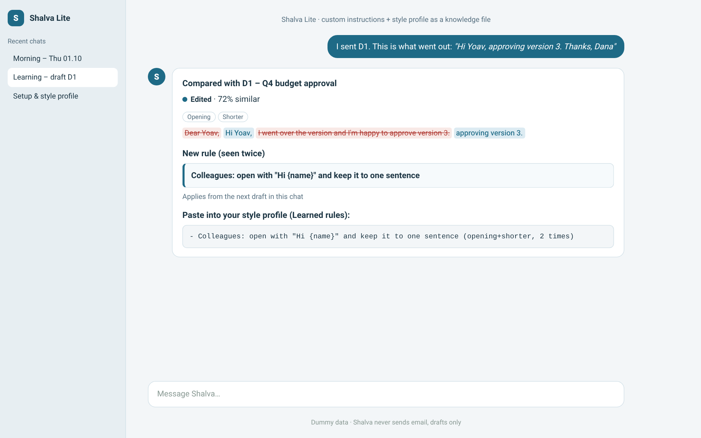

# Shalva Lite – for ChatGPT, Gemini and Claude Projects

[עברית](../he/lite.md) · [Back to main page](../../README.md)

A light version of Shalva. It works in any AI chat that accepts standing instructions and a knowledge file. It learns your style, triages, drafts replies and learns from your edits.

**How it differs from the full version:**
- No live dashboard.
- No separate drafting sessions.
- Anything the platform can't do in your mailbox (labeling, archiving), Shalva gives you as an action list.

| Morning brief in chat | Learning from a draft |
|---|---|
|  |  |

## Files
| File | What to do with it |
|---|---|
| [`platforms/lite/INSTRUCTIONS.md`](../../platforms/lite/INSTRUCTIONS.md) | Paste into the instructions field (~6,000 characters) |
| [`platforms/lite/STYLE-PROFILE-TEMPLATE.md`](../../platforms/lite/STYLE-PROFILE-TEMPLATE.md) | Upload as a knowledge file. Replace it with the profile Shalva generates during setup |

## Install in ChatGPT (Custom GPT)
1. **Explore GPTs → Create → Configure.**
2. **Name:** `Shalva`. Paste `INSTRUCTIONS.md` into **Instructions**.
3. Under **Knowledge**, upload `STYLE-PROFILE-TEMPLATE.md`.
4. If you have a Gmail or Outlook connector in ChatGPT, turn it on so Shalva can read email. Without one, paste emails into the chat.
5. **Create.**

## Install in Gemini (Gem)
1. **Gems → New Gem.**
2. Paste `INSTRUCTIONS.md` into the instructions and upload the template as a file.
3. Turn on the Gmail / Workspace connection.
4. **Save.**

## Install in Claude (Project)
1. **Projects → New project.**
2. Paste `INSTRUCTIONS.md` into **Project instructions** and upload the template to Project knowledge.
3. Connect Gmail in Connectors.

On Claude, consider the [full version](claude.md) instead. It adds automatic labeling, a dashboard and learning from drafts.

## Setup (once)
1. Type **"Hi Shalva, let's start"**.
2. Shalva asks about language, work days and hours, clients and labels.
3. It learns your style from 20–40 emails you sent. Paste them if it has no mail access.
4. It returns a full **style profile**. Save it as a file and replace the template in the knowledge files.

## Daily use
- **"Morning"** gives you:
  - a task table
  - drafts with IDs (D1, D2…)
  - a "to file" list with one-line summaries
  - suggested focus time
  - insights
- **Automatic run (optional):** set a scheduled prompt "Shalva, morning triage" on work days at 07:00, if your account supports it. ChatGPT calls these Tasks; Gemini calls them Scheduled actions.
- **Learning:** type "I sent D2, here's the text: …". Shalva compares the two. If a change repeats, it gives you a rule to paste into your profile.
- **Search:** ask "what happened with {client}?" and Shalva searches earlier summaries in the chat, and your mailbox if it has access.

## Update to a new version
1. Download the new `shalva-lite.zip` from Releases.
2. Replace the instructions in the instructions field.
3. **Keep your style profile.** It's yours.

## Uninstall
1. **Delete the GPT / Gem / Project.**
2. **Delete the scheduled task**, if you created one.
3. **Disconnect the mail connector** (optional).

Shalva Lite never changed anything in your mailbox unless you asked, so there is nothing to clean up there.

## Troubleshooting
| What happens | What to do |
|---|---|
| "Instructions too long" | If your limit is lower than ~6,000 characters, upload `INSTRUCTIONS.md` as a knowledge file. Then write in the instructions field: "Follow INSTRUCTIONS.md exactly." |
| Shalva can't see your email | Check that the mail connector is on in the chat, or paste the emails |
| The style is off | Add more short quotes of yours to the profile, and report the drafts you sent |

## Privacy and safety
- **Sending:** Shalva never sends email.
- **Deleting:** Shalva never deletes anything.
- **Facts:** Shalva never invents information.
- **Payment requests:** Shalva never replies to them.
- **Tracking:** none. Shalva reports nothing anywhere.
