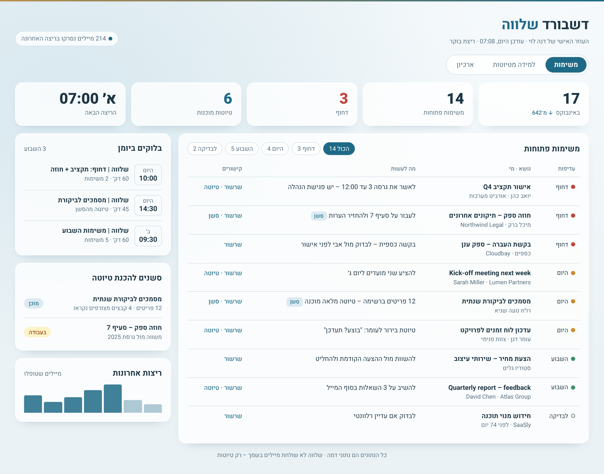
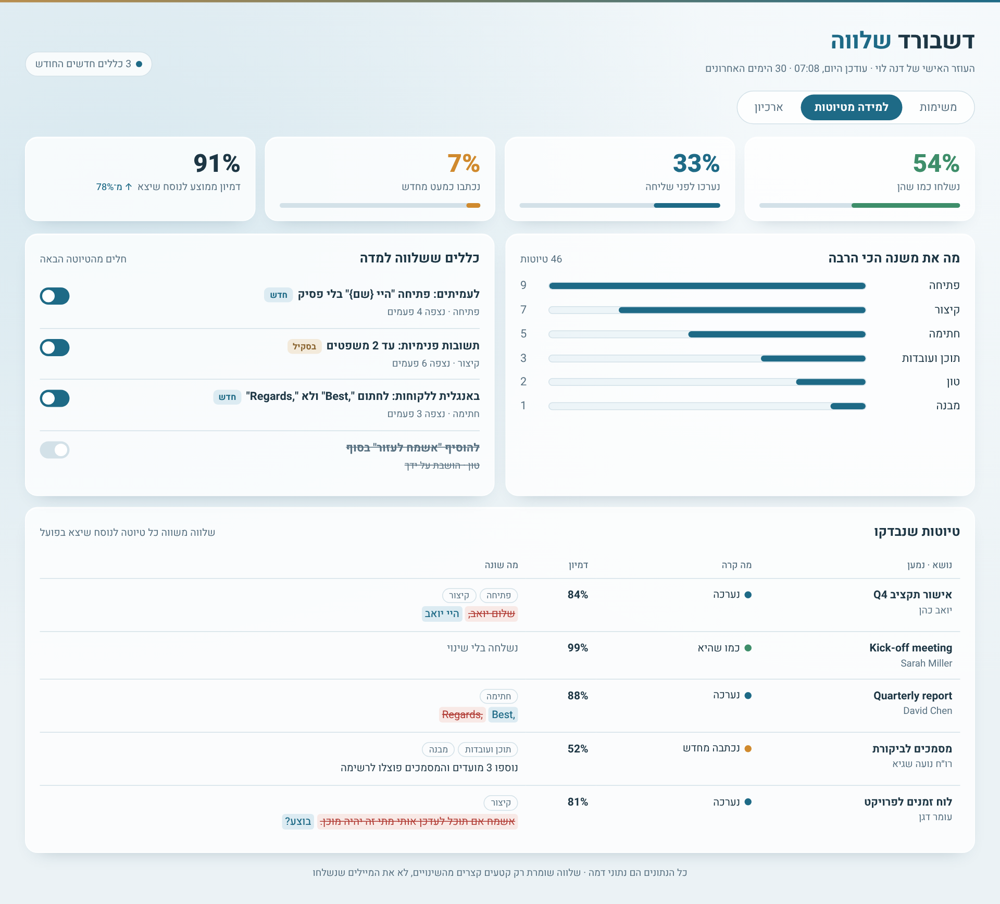
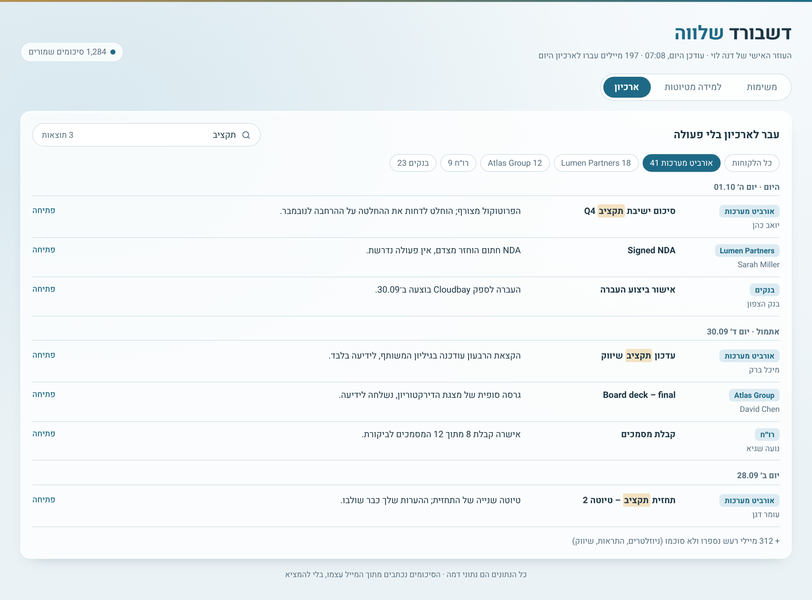
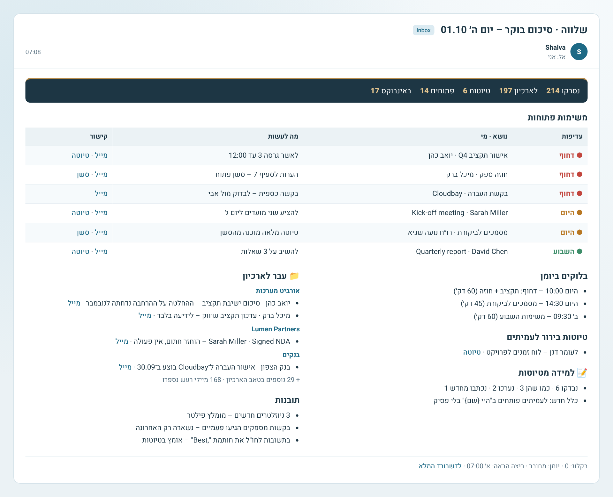

# שלווה ל־Claude – הגרסה המלאה

[English](../en/claude.md) · [חזרה לדף הראשי](../../README.he.md)

זו הגרסה המלאה של שלווה, ל־Gmail ו־Google Calendar. היא רצה לבד כל בוקר.

## מה מקבלים

| דשבורד – משימות | למידה מטיוטות |
|---|---|
|  |  |
| **ארכיון עם חיפוש** | **מייל סיכום בוקר** |
|  |  |

- **טריאז' יומי:**
  - מה שלא דורש טיפול מקבל תווית לקוח, עובר לארכיון ומסומן כנקרא, עם סיכום של שורה אחת.
  - מה שדורש טיפול נשאר באינבוקס כלא נקרא, עם תווית עדיפות.
- **טיוטות בסגנון שלך:** בשפה של המייל הנכנס. כולל טיוטות בירור לעמיתים ("בוצע? תעדכן").
- **זמני עבודה ביומן:** עד 3 בלוקים ביום, בלי משתתפים ובלי הזמנות.
- **סשנים למיילים מורכבים:** סשן נפרד שקורא את כל השרשור והקבצים ומכין טיוטה מלאה.
- **למידה מטיוטות:** משווה כל טיוטה למה שנשלח בפועל. שינוי שחוזר הופך לכלל.
- **דשבורד חי:** שלושה טאבים – משימות, למידה מטיוטות וארכיון.
- **מייל סיכום** בסוף כל ריצה.

## דרישות
- **Claude:** תוכנית Pro, Max, Team או Enterprise.
- **הרצת קוד ויצירת קבצים:** מופעלות, כי Skills דורשים אותן.
- **משימות מתוזמנות (Scheduled tasks):** זמינות בחשבון.
- **מחברים:** Gmail (חובה) ו־Google Calendar (מומלץ).

## התקנה
1. **הורדה:** מורידים את `shalva-inbox-agent.zip` מעמוד ה־[Releases](../../../../releases/latest). לא מחלצים אותו.
2. **העלאה ל־Claude:** ב־**Settings → Capabilities → Skills** לוחצים **Upload skill** ובוחרים את הקובץ. בגרסאות מסוימות זה נמצא תחת **Customize → Skills**.
3. **חיבור Gmail ו־Calendar:** ב־**Settings → Connectors**.
4. **הפעלה:** פותחים שיחה חדשה וכותבים: **"תקים לי את שלווה"**.

## ההקמה (פעם אחת, 20–40 דקות)
שלווה מובילה את התהליך. מה שקורה בדרך:
1. **שפה:** שואלת באיזו שפה לתקשר איתך.
2. **שאלות:** כמה שאלות על עצמאות, שעות עבודה, תקציב לריצה ויומן.
3. **סקירה:** סופרת את התוויות ואת מה שיש באינבוקס.
4. **לימוד הסגנון:** קוראת 150–300 מיילים ששלחת.
5. **ספר תיוג:** בונה מיפוי דומיין → תווית. לגבי שולחים משותפים, כמו בנקים ורו"ח, היא שואלת אותך.
6. **טיוטות ישנות:** ממליצה מה למחוק, ומוחקת רק אחרי שאישרת.
7. **בנייה:**
   - תוויות `00 שלווה/…`
   - Skill אישי `shalva-<שם>`. **צריך ללחוץ Save בכרטיס שמופיע**.
   - משימה מתוזמנת לבוקר
   - דשבורד

## שימוש יומיומי
- **בבוקר:** מגיע מייל "שלווה · סיכום בוקר" עם המשימות הפתוחות, הקישורים והטיוטות.
- **מה שנשאר באינבוקס:** מסומן כלא נקרא ודורש ממך פעולה.
- **טיוטות:** נמצאות בתיקיית הטיוטות ב־Gmail. עורכים ושולחים בעצמך. שלווה לעולם לא שולח.
- **דשבורד:**
  - טאב **ארכיון:** חיפוש לפי לקוח, שולח, נושא או סיכום.
  - טאב **למידה:** מפעילים או משביתים כללים.
- **כלל חדש:** כששלווה לומדת כלל, המייל מציין כמה כללים מחכים לשילוב. בשיחה הבאה כותבים "תעדכן את הסקיל עם הכללים" ושומרים את הכרטיס.

## עדכון לגרסה חדשה
1. מורידים את ה־zip החדש מה־Releases.
2. ב־**Settings → Capabilities → Skills** מוחקים את `shalva-inbox-agent` הישן ומעלים את החדש.
3. כותבים ל־Claude: **"תעדכן את שלווה שלי לפי הגרסה החדשה"**.
4. היא משלבת את השינויים ב־Skill האישי ומציגה כרטיס לשמירה.

ה־Skill האישי, הדשבורד והמשימה המתוזמנת ממשיכים לעבוד בלי הפסקה. ב־[CHANGELOG](../../CHANGELOG.md) רואים מה השתנה.

## הסרה מלאה
שלווה לא מחקה אף מייל, ולכן גם ההסרה לא נוגעת במיילים. מסירים בסדר הזה:
1. **עוצרים את הריצות:** כותבים ל־Claude "תמחק את המשימה המתוזמנת של שלווה", או מוחקים אותה מרשימת המשימות המתוזמנות.
2. **מוחקים את ה־Skills:** ב־**Settings → Capabilities → Skills**, מוחקים את `shalva-<שם>` ואת `shalva-inbox-agent`.
3. **מוחקים את הדשבורד:** מגלריית ה־Artifacts.
4. **מנקים את Gmail (רשות):**
   - מוחקים את התוויות `00 שלווה/…`. מחיקת תווית לא מוחקת את המיילים שעליה.
   - תוויות הלקוח ששלווה הוסיפה נשארות. זה בסדר להשאיר אותן.
   - טיוטות ששלווה יצרה נשארות בתיקיית הטיוטות עד שמוחקים אותן.
5. **מנקים את היומן (רשות):** מוחקים אירועים עתידיים שהכותרת שלהם מתחילה ב־"שלווה |".
6. **מנתקים את המחברים (רשות):** את Gmail ואת Calendar, ב־**Settings → Connectors**.

## פתרון תקלות
| מה קורה | מה עושים |
|---|---|
| לא הגיע מייל בבוקר | בודקים שהמשימה המתוזמנת פעילה. אם היא מוגדרת לבקש אישור, ריצה בלי אישור נעצרת. אפשר להפעיל אישור אוטומטי בהגדרות המשימה, אם הארגון מאפשר |
| "אין גישה ליומן" | מחברים מחדש את Google Calendar ב־Connectors |
| הדשבורד לא מתעדכן | שואלים את Claude: "תבדוק ששלווה כותבת לדשבורד". ה־URL של הדשבורד צריך להופיע ב־Skill האישי |
| טיוטות בטון לא נכון | עורכים ושולחים כרגיל. אחרי פעמיים שלווה לומדת כלל. אפשר גם לכתוב את התיקון ישירות בשיחה |
| מייל קיבל תווית לא נכונה | כותבים לשלווה בשיחה, למשל "מיילים מ־X שייכים ללקוח Y". הכלל נכנס ל־Skill האישי |

## פרטיות ובטיחות
- **שליחה:** שלווה שולחת מיילים רק אלייך.
- **מחיקה:** שלווה לא מוחקת ולא מעבירה לאשפה.
- **בקשות כספיות:** שלווה לא עונה עליהן.
- **המידע:** נשאר בחשבון ה־Claude וה־Gmail שלך.
- **דיווח שימוש:** אין. שלווה לא מדווחת שום דבר לשום מקום.
