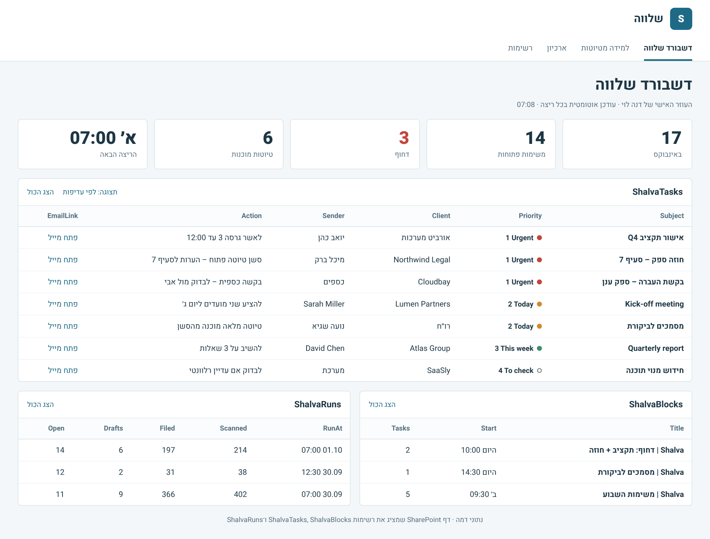
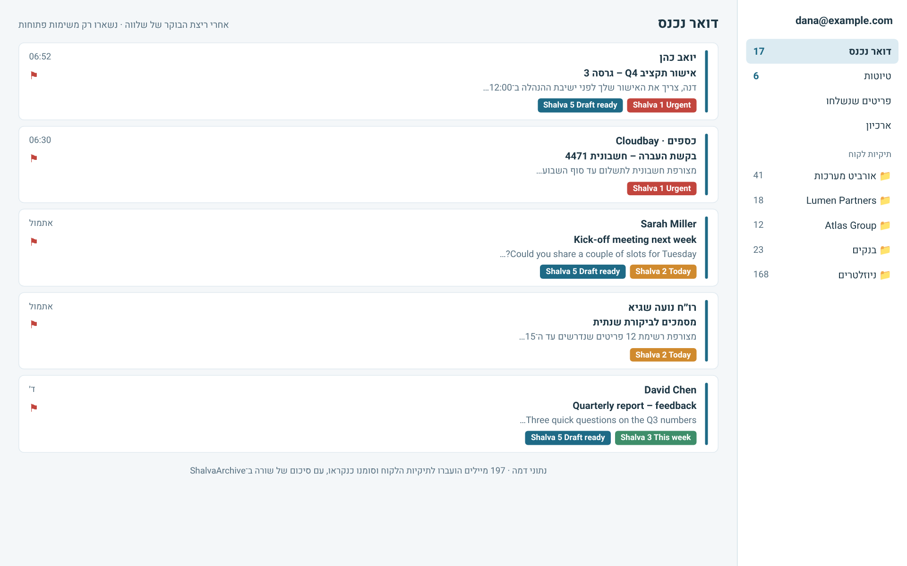
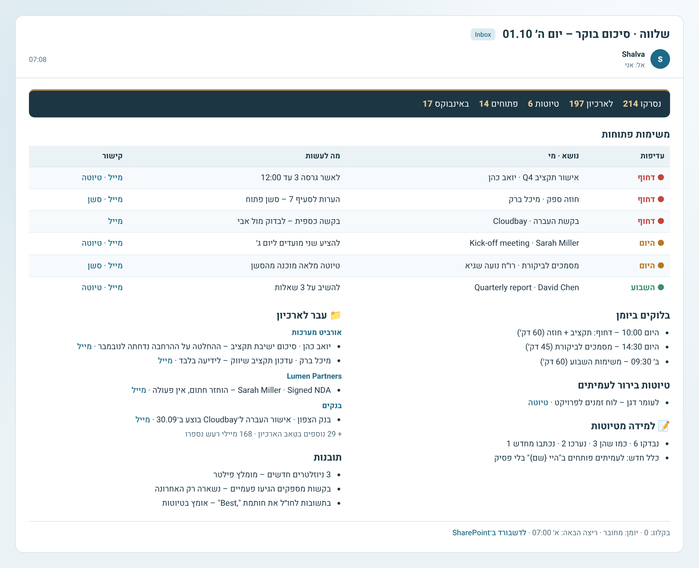

# שלווה ל־Copilot – Outlook ו־Microsoft 365

[English](../en/copilot.md) · [חזרה לדף הראשי](../../README.he.md)

גרסה מלאה של שלווה ל־Outlook. זה סוכן אוטונומי ב־Copilot Studio שרץ לבד כל בוקר ועושה בדיוק את מה שהגרסה ל־Claude עושה:

- מתייקת כל מייל לתיקיית הלקוח ומסמן אותו כנקרא, עם סיכום של שורה אחת.
- ממיינת את מה שנשאר לפי עדיפות, בקטגוריות ובדגל.
- מכינה טיוטות בסגנון שלך.
- קובעת זמני עבודה ביומן.
- לומדת מהטיוטות ששלחת.
- מעדכנת דשבורד ב־SharePoint ושולחת לך מייל סיכום.

| דשבורד ב־SharePoint | האינבוקס אחרי ריצת בוקר | מייל סיכום |
|---|---|---|
|  |  |  |

זמן בנייה משוער: 60–90 דקות, פעם אחת.

## הקבצים
| קובץ | תפקיד |
|---|---|
| [`agent/INSTRUCTIONS.md`](../../platforms/copilot/agent/INSTRUCTIONS.md) | ההוראות של הסוכן (כ־5,000 תווים) |
| [`agent/SHALVA-PLAYBOOK.md`](../../platforms/copilot/agent/SHALVA-PLAYBOOK.md) | קובץ ידע: כל הנהלים בפירוט |
| [`agent/STYLE-PROFILE.md`](../../platforms/copilot/agent/STYLE-PROFILE.md) | קובץ ידע: תבנית לפרופיל הסגנון. שלווה ממלא אותה |
| [`agent/SUMMARY-EMAIL.html`](../../platforms/copilot/agent/SUMMARY-EMAIL.html) | קובץ ידע: תבנית מייל הסיכום |
| [`sharepoint/create-lists.ps1`](../../platforms/copilot/sharepoint/create-lists.ps1) | סקריפט שיוצר את 7 הרשימות |
| [`sharepoint/lists-schema.md`](../../platforms/copilot/sharepoint/lists-schema.md) | מבנה הרשימות, למי שבונה ידנית |
| [`sharepoint/formatting/*.json`](../../platforms/copilot/sharepoint/formatting) | עיצוב עמודות: נקודות עדיפות, תוצאת טיוטה, כפתור הפעלה/השבתה של כלל |

## דרישות
- **רישיון:** Microsoft 365 עם Outlook ו־SharePoint.
- **Copilot Studio:** גישה ליצירת סוכנים, טריגרים (Event triggers) ו־Connectors. בהרבה ארגונים ה־IT צריך לאשר את זה במדיניות ה־DLP של Power Platform.
- **עלות:** הפעלות אוטומטיות נספרות בצריכה של Copilot Studio. כדאי לבדוק עם ה־IT מה המודל אצלכם.
- **אתר SharePoint:** אתר אישי או אתר צוות שרק לך יש אליו גישה.

## התקנה

### 1. הכנה ב־Outlook
1. **קטגוריות:** יוצרים 6 קטגוריות, בדיוק בשמות האלה:
   - `Shalva 1 Urgent` (אדום)
   - `Shalva 2 Today` (כתום)
   - `Shalva 3 This week` (ירוק)
   - `Shalva 4 To check` (אפור)
   - `Shalva 5 Draft ready` (כחול)
   - `Shalva 6 Waiting`
2. **תיקיות:** מוודאים שיש תיקייה לכל לקוח או נושא. אם חסרות, שלווה תציע אותן בהקמה.

### 2. הרשימות ב־SharePoint
**אפשרות א' – סקריפט:**
```powershell
Install-Module PnP.PowerShell -Scope CurrentUser
./platforms/copilot/sharepoint/create-lists.ps1 -SiteUrl "https://<tenant>.sharepoint.com/sites/<site>" -ClientId "<app-id>"
```
צריך אפליקציה ב־Entra שהארגון מאשר ל־PnP.

**אפשרות ב' – ידנית:** יוצרים את הרשימות לפי [`lists-schema.md`](../../platforms/copilot/sharepoint/lists-schema.md).

**עיצוב העמודות:** בכל עמודה בוחרים "עיצוב עמודה זו" ← מצב מתקדם ← מדביקים את קובץ ה־JSON המתאים:
- ShalvaTasks / Priority ← `priority-column.json`
- ShalvaDrafts / Outcome ← `outcome-column.json`
- ShalvaRules / Status ← `rule-status-column.json` (כולל כפתור "השבת/הפעל")

### 3. הדשבורד
יוצרים שלושה דפים ומקשרים ביניהם בניווט העליון, כך שיתנהגו כמו טאבים:
1. **"דשבורד שלווה":** רכיבי רשימה של ShalvaTasks, ShalvaBlocks, ShalvaSessions ו־ShalvaRuns.
2. **"למידה מטיוטות":** ShalvaDrafts ו־ShalvaRules.
3. **"ארכיון":** ShalvaArchive. לרשימה יש חיפוש מובנה, וסינון לפי Client.

### 4. יצירת הסוכן
1. ב־Copilot Studio: **Create → New agent → Configure**.
2. **Name:** `Shalva`.
3. **Instructions:** מדביקים את `INSTRUCTIONS.md`, ומחליפים בו שני ערכים:
   - `OWNER_EMAIL` – הכתובת שלך
   - `COMMUNICATION_LANGUAGE` – למשל `Hebrew`
4. **Knowledge:** מעלים את `SHALVA-PLAYBOOK.md`, `STYLE-PROFILE.md` ו־`SUMMARY-EMAIL.html`. אם סוג הקובץ לא נתמך, משנים את הסיומת ל־`.txt`.
5. **Settings:**
   - Generative orchestration – פועל
   - Web search – כבוי
   - ידע כללי – כבוי

### 5. כלים (Tools)
מוסיפים רק את הכלים שבטבלה. **לא מוסיפים** Reply, Forward, Delete email או Send email רגיל. כך "לא שולחים לאף אחד" נאכף טכנית, לא רק בהוראות.

| Connector | פעולה | שם הכלי | הגדרה חשובה |
|---|---|---|---|
| Office 365 Outlook | Get emails (V3) | Get emails | |
| | Get email (V2) | Get email | |
| | Move email (V2) | Move email | |
| | Flag email (V2) | Flag email | |
| | Mark as read or unread (V3) | Mark read/unread | |
| | Assigns an Outlook category | Assign category | |
| | Draft an email message | Draft an email message | גיבוי לטיוטה מחוץ לשרשור |
| | Get events (V4) | Get events | |
| | Find meeting times (V2) | Find free time | |
| | Create event (V4) | Create focus block | תיאור: "No attendees. Title starts with 'Shalva \|'" |
| | Delete event (V2) | Delete focus block | תיאור: "Only Shalva focus blocks whose tasks are done and that haven't started" |
| | Send an email (V2) | **Send summary to me** | **To = Custom value = הכתובת שלך**, לא ממולא על ידי ה־AI |
| SharePoint | Get items | Read list | Site Address = Custom value |
| | Create item | Add list item | Site Address = Custom value |
| | Update item | Update list item | Site Address = Custom value |
| | Delete item | Delete list item | תיאור: "Only ShalvaTasks items whose task is done" |

### 6. Agent flow לטיוטה בתוך השרשור
1. **Add tool → New agent flow.**
2. **טריגר:** When an agent calls the flow. קלטים: `MessageId` ו־`ReplyText`.
3. **פעולה:** Office 365 Outlook → **Send an HTTP request**
   - Method: `POST`
   - URI: `https://graph.microsoft.com/v1.0/me/messages/@{triggerBody()['MessageId']}/createReply`
   - Body: `{ "comment": "@{triggerBody()['ReplyText']}" }`
4. **Respond to the agent** עם `DraftId` = `body('Send_an_HTTP_request')?['id']` ו־`DraftLink` = `body('Send_an_HTTP_request')?['webLink']`.
5. שם הכלי: `Create reply draft`.

ה־URI קבוע ל־`createReply`, כך שהזרימה הזאת לא יכולה לשלוח מייל. אם הארגון חוסם את הפעולה, מדלגים על השלב הזה. שלווה ישתמש ב־"Draft an email message", והטיוטה תהיה מחוץ לשרשור.

### 7. טריגרים
| טריגר | הגדרה | טקסט לסוכן |
|---|---|---|
| Recurrence | שבועי, ימי העבודה, 07:00, אזור הזמן שלך | `MORNING RUN` |
| Recurrence | אותם ימים, 12:30 | `FOLLOW-UP RUN` |
| SharePoint – When an item is created | רשימה ShalvaSessions | `DEEP DRAFT item {ID}` |

כל הטריגרים והכלים רצים עם ההרשאות שלך, כמו שנדרש מסוכן אוטונומי. לכן **לא משתפים את הסוכן עם אחרים.**

### 8. הקמה ופרסום
1. בחלון **Test** כותבים `setup`.
2. שלווה תשאל על שפה, ימי עבודה ועצמאות, תלמד את הסגנון שלך מ־Sent Items ותבנה מפת תיוק.
3. בסוף היא מחזירה STYLE-PROFILE מלא. מחליפים בו את קובץ הידע.
4. **Publish.**
5. מפעילים את טריגר הבוקר ידנית פעם אחת, ובודקים:
   - את הרשימות
   - את הדשבורד
   - את מייל הסיכום

## שימוש יומיומי
- **בבוקר:** מגיע מייל סיכום. באינבוקס נשארים רק מיילים עם קטגוריית עדיפות ודגל.
- **טיוטות:** נמצאות בתיקיית הטיוטות. עורכים ושולחים בעצמך.
- **דשבורד:**
  - ב־**ארכיון** מחפשים לפי לקוח, שולח או נושא.
  - ב־**למידה מטיוטות** מפעילים או משביתים כללים בכפתור.
- **מייל מורכב:** שלווה פותחת פריט ב־ShalvaSessions, ותוך כמה דקות מגיעה טיוטה מלאה.

## עדכון לגרסה חדשה
1. מורידים את `shalva-copilot.zip` החדש מה־Releases. ב־[CHANGELOG](../../CHANGELOG.md) רואים מה השתנה.
2. **Instructions:** מדביקים את ה־`INSTRUCTIONS.md` החדש, ושוב מחליפים את `OWNER_EMAIL` ואת `COMMUNICATION_LANGUAGE`.
3. **Knowledge:** מחליפים את `SHALVA-PLAYBOOK.md` ואת `SUMMARY-EMAIL.html`. **את STYLE-PROFILE לא מחליפים.**
4. **שינויים ברשימות:** אם ב־CHANGELOG כתוב שנוספו עמודות, מריצים שוב את `create-lists.ps1`. הוא מוסיף רק את מה שחסר.
5. **Publish.**

## הסרה מלאה
המיילים שלך לא נמחקים בשום שלב. מסירים בסדר הזה:
1. **עוצרים את הריצות:** ב־Copilot Studio ← הסוכן ← Triggers, מוחקים או מכבים את שלושת הטריגרים.
2. **מוחקים את הסוכן:** Unpublish ואז Delete.
3. **מוחקים את ה־Agent flow** "Create reply draft", ב־Copilot Studio או ב־Power Automate → My flows.
4. **מוחקים את החיבורים:** ב־Power Automate → Connections, את חיבורי Office 365 Outlook ו־SharePoint שנוצרו לסוכן (אם לא משתמשים בהם במקום אחר).
5. **SharePoint (רשות):** מוחקים את 3 הדפים ואת 7 הרשימות. אפשר להשאיר את ShalvaArchive כארכיון לחיפוש.
6. **Outlook (רשות):**
   - מוחקים את 6 קטגוריות "Shalva". המיילים נשארים.
   - מוחקים אירועים עתידיים "Shalva |" ביומן.
   - טיוטות ששלווה יצרה נשארות בתיקיית הטיוטות עד שמוחקים אותן.

## פתרון תקלות
| מה קורה | מה עושים |
|---|---|
| לא ניתן להוסיף טריגר | ה־IT צריך לאפשר Event triggers ו־Solution-aware cloud flow sharing בסביבה |
| "Send an HTTP request" חסום | מדלגים על שלב 6. הטיוטות ייווצרו עם "Draft an email message" |
| קטגוריה לא מוחלת | שם הקטגוריה ב־Outlook חייב להיות זהה בדיוק, כולל רווחים |
| הסוכן לא כותב לרשימה | בודקים ש־Site Address מוגדר כ־Custom value, ושהרשימות בשמות המדויקים |
| הריצה עולה יותר מדי | מורידים את ריצת ההמשך (12:30), או מגבילים את ההקמה הראשונה לכמה ימים |

## פרטיות ובטיחות
- **שליחה:** הכלי היחיד ששולח נעול לכתובת שלך.
- **מחיקה:** אין כלי שמוחק מיילים. מחיקה אפשרית רק לבלוקים של שלווה ולמשימות שטופלו.
- **מידע חסוי:** מיילים שמסומנים Confidential לא נכנסים לסיכומים.
- **מעקב:** אין. שלווה לא מדווחת שום דבר לשום מקום.
