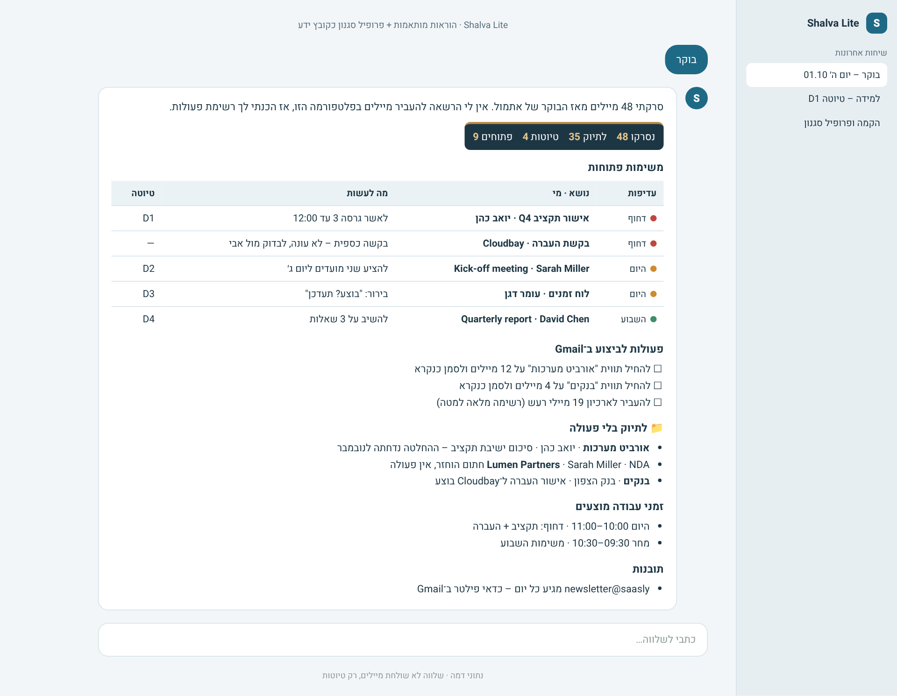
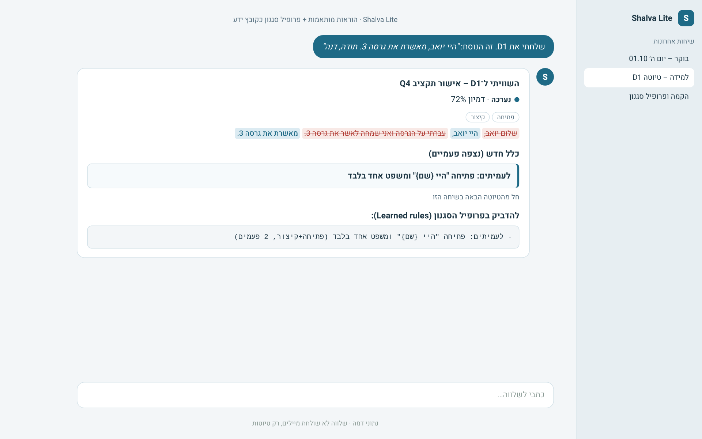

# שלווה Lite – ל־ChatGPT, ל־Gemini ול־Claude Projects

[English](../en/lite.md) · [חזרה לדף הראשי](../../README.he.md)

גרסה קלה של שלווה שעובדת בכל צ'אט AI שאפשר לתת לו הוראות קבועות וקובץ ידע. היא לומדת את הסגנון שלך, עושה טריאז', מכינה טיוטות ולומדת מהתיקונים שלך.

**ההבדל מהגרסה המלאה:**
- אין דשבורד חי.
- אין סשנים נפרדים.
- מה שהפלטפורמה לא מאפשרת לבצע במייל (תיוג, העברה לארכיון), שלווה מחזירה לך כרשימת פעולות.

| סיכום בוקר בצ'אט | למידה מטיוטה |
|---|---|
|  |  |

## הקבצים
| קובץ | מה עושים איתו |
|---|---|
| [`platforms/lite/INSTRUCTIONS.md`](../../platforms/lite/INSTRUCTIONS.md) | מדביקים בשדה ההוראות (כ־6,000 תווים) |
| [`platforms/lite/STYLE-PROFILE-TEMPLATE.md`](../../platforms/lite/STYLE-PROFILE-TEMPLATE.md) | מעלים כקובץ ידע. אחרי ההקמה מחליפים אותו בפרופיל ששלווה ייצר |

ההוראות כתובות באנגלית, כי ככה המודלים מצייתים להן בעקביות. שלווה שואלת קודם כל באיזו שפה לדבר איתך, ומשם ממשיכה בשפה שבחרת.

## התקנה ב־ChatGPT (Custom GPT)
1. **Explore GPTs → Create → Configure.**
2. **Name:** `Shalva`. מדביקים את `INSTRUCTIONS.md` ב־**Instructions**.
3. ב־**Knowledge** מעלים את `STYLE-PROFILE-TEMPLATE.md`.
4. אם יש לך חיבור (Connector) ל־Gmail או ל־Outlook ב־ChatGPT, מפעילים אותו כדי ששלווה תקרא מיילים. בלי חיבור, מדביקים מיילים לשיחה.
5. **Create.**

## התקנה ב־Gemini (Gem)
1. **Gems → New Gem.**
2. מדביקים את `INSTRUCTIONS.md` בהוראות, ומעלים את התבנית כקובץ.
3. מפעילים את החיבור ל־Gmail / Workspace.
4. **Save.**

## התקנה ב־Claude (Project)
1. **Projects → New project.**
2. מדביקים את `INSTRUCTIONS.md` ב־**Project instructions**, ומעלים את התבנית ל־Project knowledge.
3. מחברים Gmail ב־Connectors.

ב־Claude כדאי לשקול את [הגרסה המלאה](claude.md), עם תיוג אוטומטי, דשבורד ולמידה מטיוטות.

## ההקמה (פעם אחת)
1. כותבים: **"היי שלווה, בואי נתחיל"**.
2. שלווה שואלת על שפה, ימי ושעות עבודה, לקוחות ותוויות.
3. היא לומדת את הסגנון מ־20–40 מיילים ששלחת. אם אין לה גישה למייל, מדביקים לה אותם.
4. היא מחזירה **פרופיל סגנון** מלא. שומרים אותו כקובץ ומחליפים בו את התבנית בקובץ הידע.

## שימוש יומיומי
- **"בוקר"** – מקבלים:
  - טבלת משימות
  - טיוטות עם מזהה (D1, D2…)
  - רשימת "לתיוק" עם סיכום של שורה
  - זמני עבודה מוצעים
  - תובנות
- **ריצה אוטומטית (רשות):**
  - ב־ChatGPT יש משימות מתוזמנות (Tasks).
  - ב־Gemini יש Scheduled actions.
  
  מגדירים "Shalva, morning triage" בימי עבודה ב־07:00, אם החשבון תומך בזה.
- **למידה:** כותבים "שלחתי את D2, זה הנוסח: …". שלווה משווה, ואם השינוי חוזר היא נותנת כלל להדביק בפרופיל.
- **חיפוש:** "מה קרה עם {לקוח}?" – שלווה מחפשת בסיכומים קודמים בשיחה ובמייל, אם יש לה גישה.

## עדכון לגרסה חדשה
1. מורידים את `shalva-lite.zip` החדש מה־Releases.
2. מחליפים את ההוראות בשדה ההוראות.
3. את פרופיל הסגנון **לא מחליפים**. הוא שלך.

## הסרה
1. **מוחקים את ה־GPT / Gem / Project.**
2. **מוחקים משימה מתוזמנת**, אם הגדרת.
3. **מנתקים את החיבור למייל (רשות).**

שלווה Lite לא שינתה שום דבר בתיבה בלי שביקשת, כך שאין מה לנקות במייל.

## פתרון תקלות
| מה קורה | מה עושים |
|---|---|
| "ההוראות ארוכות מדי" | ההוראות כ־6,000 תווים. אם המגבלה אצלך נמוכה יותר, מעלים את `INSTRUCTIONS.md` כקובץ ידע, ובשדה ההוראות כותבים: "Follow INSTRUCTIONS.md exactly." |
| שלווה לא רואה את המיילים | בודקים שהחיבור למייל פעיל בשיחה, או מדביקים מיילים |
| הסגנון לא מדויק | מוסיפים לפרופיל עוד ציטוטים קצרים שלך, ומדווחים לשלווה על טיוטות ששלחת |

## פרטיות ובטיחות
- **שליחה:** שלווה לא שולחת מיילים.
- **מחיקה:** שלווה לא מוחקת.
- **מידע:** לא ממציאה מידע.
- **בקשות כספיות:** לא עונה עליהן.
- **מעקב:** אין. שלווה לא מדווחת שום דבר לשום מקום.
